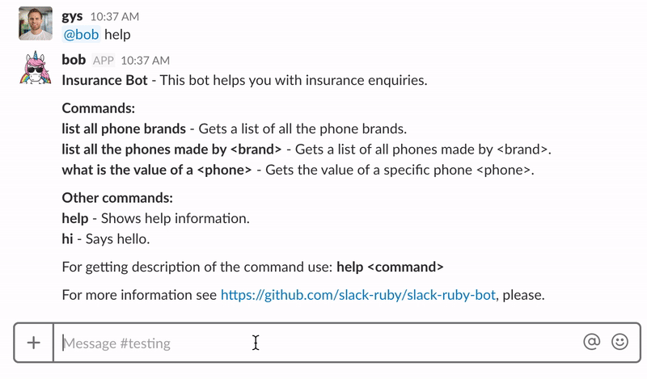

# Root Insurance Bots

This is a Rails app that allows a user to engage with the [Root Insurance API](https://github.com/RootBank/root-insurance-ruby) via either a Facebook messanger bot, Slack bot, or an Alexa skill.

## Bots

1. Facebook Bot
2. Slack Bot
3. Alexa Bot (Alexa skill)

### Facebook Bot

This is a basic facebook bot that integrates with Root's insurance API. It has the following three commands:
1. Get a list of all phone brands
2. Get a list of all phones made by `brand`
3. Get the value of a specific `phone`

#### Setting up the Facebook Bot

1. Read the facebook [getting started documentation](https://developers.facebook.com/docs/messenger-platform/getting-started/quick-start) and set up your app.
2. Set the `FACEBOOK_PAGE_ACCESS_TOKEN` environment variable to your page access token.
3. Create and set up your insurance app in the [Root developer console](https://app.root.co.za/developer/apps).
4. Set the `ROOT_APP_ID` and `ROOT_APP_SECRET` environment variables to the correct values.
5. Start your app.
6. Once you've started the app, you need to use [ngrok](https://ngrok.com/) to expose your local server to the internet. The following command will expose your server, on port 3000, to the internet: `ngrok http 3000`.
7. Ngrok will give you a url which you can use to set up your webhooks. See [here](https://developers.facebook.com/docs/messenger-platform/getting-started/app-setup).

#### Implementation

The facebook webhooks are implemented in `app/controllers/facebook/webhooks_controller.rb`. The controller delegates incoming messages to the `FacebookService` (`app/services/facebook_service.rb`).


### Slack Bot

This is a basic slack bot with three commands:
1. Get a list of all phone brands
2. Get a list of all phones made by `brand`
3. Get the value of a specific `phone`



#### Settings up the Slack Bot

The first thing you have to do is to register a Slack bot and obtain the `SLACK_API_TOKEN`. You can create a new Bot Integration here [services/new/bot](http://slack.com/services/new/bot).

#### Implementation

The bot lives in `lib/slack-insure-bot`.

The part to pay attention to is how you structure the [commands](https://github.com/slack-ruby/slack-ruby-bot/blob/master/TUTORIAL.md#commands). For example creating a command to `list all phone brands` will be structure like this:

```ruby
module SlackInsureBot
  module Commands
    class Default < SlackRubyBot::Commands::Base
      command 'list all phone brands' do |client, data, _match|
        brands = ["Samsung", "Apple", "Nokia"]

        client.say(channel: data.channel, text: brands.join("\n"))
      end
    end
  end
end
```

#### Additional information and Examples

Check out [slack-ruby-bot](https://github.com/slack-ruby/slack-ruby-bot/). This is the main lib where everything is copied from ;)

* [slack-bot-on-rails](https://github.com/dblock/slack-bot-on-rails): A bot running on Rails and using React to display Slack messages on a website.
* [slack-mathbot](https://github.com/dblock/slack-mathbot): Slack integration with math.
* [slack-google-bot](https://github.com/dblock/slack-google-bot): A Slack bot that searches Google, including CSE.
* [slack-aws](https://github.com/dblock/slack-aws): Slack integration with Amazon Web Services.
* [slack-deploy-bot](https://github.com/accessd/slack-deploy-bot): A Slack bot that helps you to deploy your apps.
* [slack-gamebot](https://github.com/dblock/slack-gamebot): A game bot service for ping pong, chess, etc, hosted at [playplay.io](http://playplay.io).
* [slack-victorbot](https://github.com/uShip/victorbot): A Slack bot to talk to the Victorops service.

### Alexa Bot (Alexa Skill)
An Alexa Skill is essentially an app that runs on an Amazon Echo.

You can ask Alexa to:
1. Get a list of all phone brands
2. Get a list of all phones made by `brand`

#### Setting up the Alexa Skill

* Setup an Amazon Echo and register it using your personal Amazon account.
* Register for an Amazon developer account and setup the Alexa skill [here](https://developer.amazon.com/edw/home.html).

##### Skill Information

Add "Insurance Helper" as both the `Name` and the `Invocation Name`.

##### Interaction Model
The interaction model is by far the hardest part of creating an Alexa skill. I suggest reading [this](https://developer.amazon.com/docs/custom-skills/custom-interaction-model-reference.html) and watching this [video](https://www.youtube.com/watch?v=0V_rNKx-P1I) in order to get a basic understanding of what is required to create an interaction model.

1. Add the JSON blob found in `interaction_model/intent_schema.json` in the Intent Schema field.
2. Create a new *Custom Slot Type* and the values found in `interaction_model/custom_slots/LIST_OF_BRANDS`.
3. Add the *Sample Utterances* found in `interaction_model/sample_utterances.txt` in the Sample Utterances field.

##### Configuration

1. Select **HTTPS** as the Service Endpoint Type.
2. Once you've started the app, you need to use [ngrok](https://ngrok.com/) to expose your local server to the internet. Once your app is running, you need to run `ngrok http 3000` to do this. You'll then get an url which you can add in the **Default** field. It will looks something like this `https://056d1d30.ngrok.io/alexa`.

##### SSL Configuration

Select the option `My development endpoint is a sub-domain of a domain that has a wildcard certificate from a certificate authority`.

##### Implementation

The Alexa skill posts data to the `WebhooksController`. Here we then call the `AlexaService` which figures out the intent of [the request and generates a response](https://developer.amazon.com/docs/custom-skills/request-and-response-json-reference.html). This gets send back to the Alexa Skill and is verbalized by the Echo.

##### Additional information

* [Building Alexa Skills](https://developer.amazon.com/appsandservices/solutions/alexa/alexa-skills-kit/getting-started-guide)
* [Alexa skill videos](https://www.youtube.com/watch?v=0V_rNKx-P1I)

## Running the app

The first step is to add the necessary secrets in `config/settings.yml`.

**Install the gems**

    bundle install

**Run migrations**

    rails db:migrate

**Start the server**

    rails s

**Setup ngrok to expose the endpoint**

    ngrok http 3000
